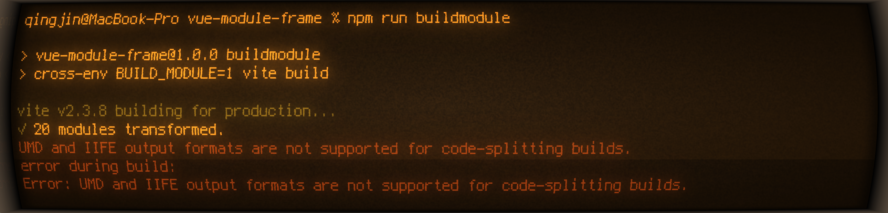

# 教程

## 这是什么玩意儿？

vue-module-loader 是专注于 Vue 生态的微前端模块加载器，vue-module-loader 支持加载使用 vite 构建出的[符合规范的微前端模块](#模块介绍)，让你轻松实现微前端架构。

## 重要的二维码

| qq 群交流                                                      | 开源不易                                                        | 酌情支持                                                        |
| -------------------------------------------------------------- | --------------------------------------------------------------- | --------------------------------------------------------------- |
|  |  |  |

## 快速上手

### 即用模板

强烈推荐使用 [vue-module-creator](https://github.com/mqhe2007/vue-module-creator) 创建模板工程。

模板项目是非典型 [vite](https://cn.vitejs.dev/) 工程，并主要使用 vite 的以下特性：

- [库模式](https://cn.vitejs.dev/guide/build.html#library-mode)

1. 安装命令行工具

   ```bash
   npm install -g vue-module-creator
   # 或使用yarn
   yarn global add vue-module-creator
   ```

2. 创建工程

   ```bash
   vml create
   ```

3. 跟随引导操作

   

### 自由配置

当前版本只支持由 vite 创建的项目

1.  安装

    ```bash
    yarn add vue-module-loader@next
    ```

    :::warning 注意：
    务必使用 next 标签安装本文档介绍的版本
    :::

2.  使用

    ```js
    // main.js
    // 需要整体导入Vue3对象
    import * as vue from "vue";
    import vml from "vue-module-loader";
    const app = vue.createApp({});
    app.use(vml, vue);
    ```

    安装后在任意 js 或 vue 文件中使用

    ```js
    import { useModule } from "vue-module-loader";
    useModule(
      "http://static.mengqinghe.com/vml/module/vue-module-module.iife.js"
    );
    ```

    更多信息见：[API 用法](/api/#具名方法)

### 构建

模块打包情况如下表：

<table>
   <tr>
      <td>阶段</td>
      <td>模块</td>
      <td>打包类型</td>
   </tr>
   <tr>
      <td rowspan="2">开发</td>
      <td>主框架</td>
      <td>运行包、模块包</td>
   </tr>
   <tr>
      <td>子模块</td>
      <td>模块包</td>
   </tr>
   <tr>
      <td rowspan="2">部署</td>
      <td>主框架</td>
      <td>运行包</td>
   </tr>
   <tr>
      <td>子模块</td>
      <td>模块包</td>
   </tr>
</table>

#### 运行包

等于普通 vite 项目使用“npm run build”命令构建出的代码包，储存在 dist 目录中，部署 web 服务器后可以直接通过浏览器运行。

终端定位到项目根目录，执行命令：

```bash
npm run build
```

#### 模块包

使用“npm run buildmodule”命令构建出的代码包，储存在 dist/module 目录中，部署 web 服务器后可以通过 <模块名>.iife.js 文件地址访问到静态资源。

终端定位到项目根目录，执行命令：

```bash
npm run buildmodule
```

:::tip 提示：
当需要一次性构建运行包和模块包的时候，一定要按照先运行包后模块包的顺序执行构建命令，方可同时使用`dist`目录。
:::

## 模块介绍

模块目录结构和 vite 官方 Vue 项目几乎一致，只是在运行包入口，模块包入口和构建配置有些许差别，下面一一介绍。

### 运行包入口

**/src/main.js**

`src/main.js`依然是构建应用程序（运行包）和本地开发服务的入口文件，我们要做的就是要把当前模块本身的模块对象`src/module.js`导入进来。

```js
// 这里需要整体导入Vue3对象
import * as Vue from "vue";
import { useModule } from "vue-module-loader";
// 当前模块对象，由模块包入口提供，见下文。
import localModule from "./module";
useModule(
  "http://static.mengqinghe.com/vml/frame/vue-module-frame.iife.js",
  Vue // 作为主框架的模块，需要传入Vue对象供所有子模块使用。
).then(() => {
  useModule(localModule);
});
```

### 模块包入口

**/src/module.js**

微前端模块新增了`/src/module.js`文件作为打模块包入口文件，此文件默认导出一个[模块对象]()。

```js
import { name } from "../package.json";
import routes from "./routes";
// 导出模块定义对象
export default {
  name, // 模块名称
  // 模块安装时钩子
  install(
    /**
     * 使用jsdoc配合IDE支持类型提示
     * @type {import('vue-module-loader/src/interfaces').Context}
     */
    context
  ) {
    // 演示业务：动态添加路由
    routes.forEach(item => {
      context.app.config.globalProperties.$router.addRoute(item);
    });
  },
  // 模块卸载时钩子
  uninstall() {
    // 卸载时需要清理的逻辑
  },
};
```

:::warning 注意：
再次提醒，`src/main.js`文件只在构建运行包和本地开发服务时有效，构建成模块包时无效。所以当你的代码需要包含在微前端模块中时，应该最终导入`src/module.js`文件，并随着模块对象导出。
:::

### 构建配置

#### 配置 vite.config.js

运行包无需特殊配置，符合 vite 配置即可。

模块包需如下配置：

```js
config.build = {
  outDir: "./dist/module/",
  sourcemap: "inline",
  lib: {
    entry: resolve(__dirname, "src/module.js"),
    // 格式必须为iife
    formats: ["iife"],
    name: "moduleName",
  },
  rollupOptions: {
    // 为了使所有模块共用Vue对象，必须外置化Vue
    external: ["vue"],
    output: {
      globals: {
        vue: "vue",
      },
    },
  },
};
```

#### 配置 package.json

```json
{
  "scripts": {
    // 启动本地开发服务
    "dev": "vite",
    // 打运行包，主框架模块需要，其他子模块不需要
    "build": "vite build",
    // 打模块包，注意不要漏掉 BUILD_MODULE 环境变量
    "buildmodule": "cross-env BUILD_MODULE=1 vite build"
  }
}
```

### 模块部署

模块打包后皆为静态资源文件，部署没有统一流程，能通过 url 访问到打包后文件即可。

### 注意事项

1. 由于 Rollup 打包为 IIFE 格式时不支持代码拆分，所以模块编写 vue-router 路由配置时，组件不可使用`import()`动态导入，否则会收到如下错误。
   
